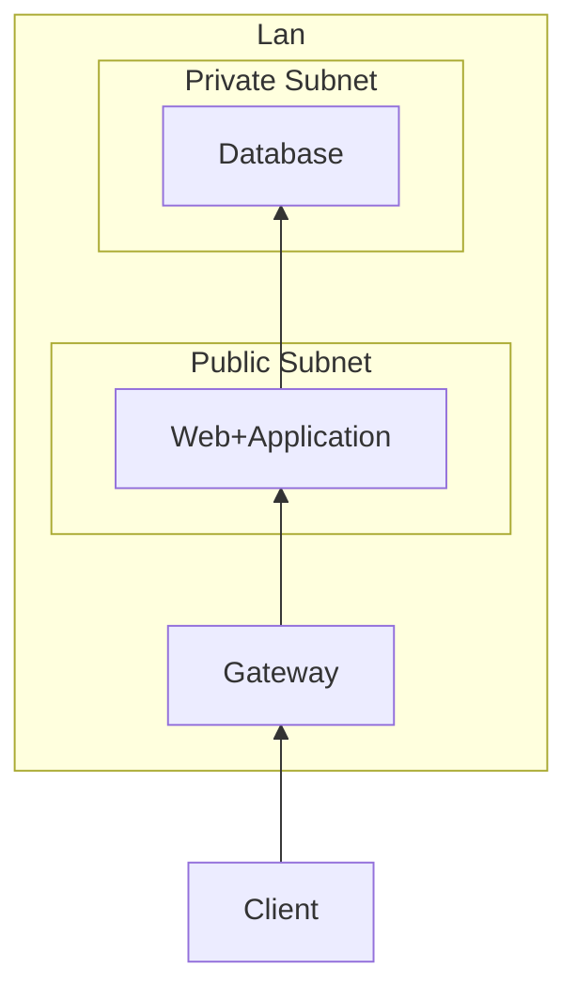
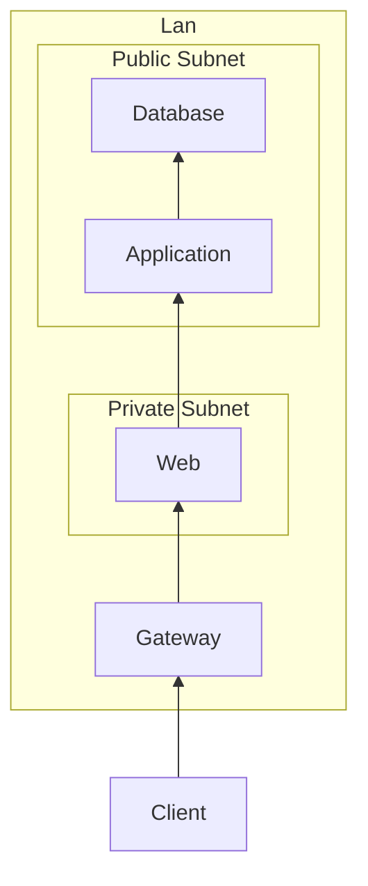

# 目次

1. [問題 1 の答え](#answer1)  
   1.1 [手順 1 　リソースの作成](#step1-1)  
   1.2 [手順 2 　パラメータの設定](#step1-2)  
   1.3 [手順 3 　ルーティングの設定](#step1-3)

1. [問題 2 の答え](#answer)  
   1.1 [手順 1 　リソースの作成](#step2-1)  
   1.2 [手順 2 　パラメータの設定](#step2-2)  
   1.3 [手順 3 　ルーティングの設定](#step2-3)

# <a id="answer1">問題 1 の答え</a>

## <a id="step1-1">手順 1 リソースの作成 </a>

- Lan を 1 つ作成してください
- Public Subnet を 1 つ作成してください
- Gateway を 1 つ作成してください
- Web サーバを 1 つ作成してください
- Application サーバを 1 つ作成してください

## <a id="step1-2">手順 2 パラメータの設定 </a>

|                       | Database    |
| --------------------- | ----------- |
| 数                    | 1           |
| ポート 番号           | 3306        |
| グローバル IP Address | None        |
| ローカル IP Address   | 192.168.2.1 |

|                       | Web           |
| --------------------- | ------------- |
| 数                    | 1             |
| リクエストポート      | 80            |
| レスポンスポート      | 80            |
| グローバル IP Address | 133.2.101.152 |
| ローカル IP Address   | 192.168.1.1   |

|                  | Public Subnet |
| ---------------- | ------------- |
| 数               | 1             |
| ポート 番号      | 80            |
| IP アドレス      | 192.168.1.0   |
| サブネットマスク | 30            |

|                       | Gateway |
| --------------------- | ------- |
| 数                    | 1       |
| グローバル IP Address | none    |
| インバウンドポート    | 80      |
| アウトバウンドポート  | 80      |

|                  | Lan            |
| ---------------- | -------------- |
| 数               | 1              |
| IP アドレス      | 192.168.0.0/22 |
| サブネットマスク | 22             |

|                       | Client |
| --------------------- | ------ |
| 数                    | 1      |
| ポート 番号           | 80     |
| グローバル IP Address | none   |
| ローカル IP Address   | none   |

## <a id="step1-3">手順 3 ルーティングの設定 </a>

の順で繋いでください

# <a id="answer2">問題 2 の答え</a>

## <a id="step2-1">手順 1 リソースの作成 </a>

- Lan を 1 つ作成してください
- Public Subnet を 1 つ作成してください
- Gateway を 1 つ作成してください
- Web サーバを 1 つ作成してください
- Application サーバを 1 つ作成してください
- Database サーバを 1 つ作成してください

## <a id="step2-2">手順 2 パラメータの設定 </a>

|                       | Database    |
| --------------------- | ----------- |
| 数                    | 1           |
| ポート 番号           | 3306        |
| グローバル IP Address | none        |
| ローカル IP Address   | 192.168.2.2 |

|                       | Application |
| --------------------- | ----------- |
| 数                    | 1           |
| ポート 番号           | 8000        |
| グローバル IP Address | None        |
| ローカル IP Address   | 192.168.2.1 |

|                       | Web           |
| --------------------- | ------------- |
| 数                    | 1             |
| リクエストポート      | 80            |
| レスポンスポート      | 80            |
| グローバル IP Address | 133.2.101.152 |
| ローカル IP Address   | 192.168.1.1   |

|                      | Public Subnet |
| -------------------- | ------------- |
| 数                   | 1             |
| インバウンドポート   | 80            |
| アウトバウンドポート | 80            |
| IP アドレス          | 192.168.1.0   |
| サブネットマスク     | 30            |

|                      | Private Subnet |
| -------------------- | -------------- |
| 数                   | 1              |
| IP アドレス          | 192.168.2.0    |
| インバウンドポート   | 80             |
| アウトバウンドポート | 80             |
| サブネットマスク     | 30             |

|                       | Gateway |
| --------------------- | ------- |
| 数                    | 1       |
| グローバル IP Address | none    |
| インバウンドポート    | 80      |
| アウトバウンドポート  | 80      |

|                  | Lan            |
| ---------------- | -------------- |
| 数               | 1              |
| IP アドレス      | 192.168.0.0/22 |
| サブネットマスク | 22             |

|                       | Client |
| --------------------- | ------ |
| 数                    | 1      |
| ポート 番号           | 80     |
| グローバル IP Address | none   |
| ローカル IP Address   | none   |

## <a id="step2-3">手順 3 ルーティングの設定 </a>

の順で繋いでください
