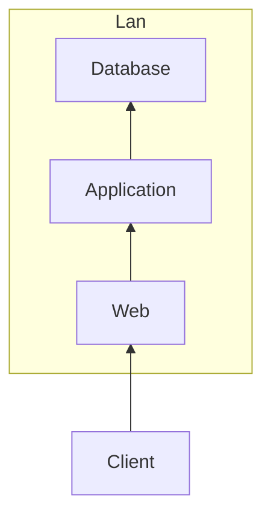

# 目次

- [目次](#目次)
  - [<a id="how-the-web-works">インターネットの仕組み</a>](#インターネットの仕組み)
  - [<a id="what-is-server">サーバとは </a>](#サーバとは-)
  - [<a id="client-server">クライアントサーバモデルについて </a>](#クライアントサーバモデルについて-)
    - [web 三層構造について](#web-三層構造について)
  - [<a id="domain">ドメインとは </a>](#ドメインとは-)
  - [<a id="ip-address">IP アドレスとは </a>](#ip-アドレスとは-)
    - [IP アドレスの計算方法](#ip-アドレスの計算方法)
  - [<a id="port">通信ポートとは </a>](#通信ポートとは-)
    - [通信ポートの対応関係の例題](#通信ポートの対応関係の例題)

## <a id="how-the-web-works">インターネットの仕組み</a>

`複数の LAN(ローカルエリアネットワーク)が ISP（インターネットサービスプロパイダ)で一旦束ねられ、IX(インターネットエクスチェンジ)によって再度束ねられて全体につながっている。 `

- [国民のための情報セキュリティサイト](https://www.soumu.go.jp/main_sosiki/joho_tsusin/security/basic/service/02.html)

- [日本電気技術者協会 電気技術解説講座](https://jeea.or.jp/course/contents/01402/)

## <a id="what-is-server">サーバとは </a>

`コンピュータの役割を指す用語の一つ。サービスや機能を提供する側のコンピュータのこと。 パソコンと異なる点としては、24 時間 365 日稼働し続けるために調整がなされている点。 「機器」としてのサーバも大事だが今回は説明しない `

- [「分かりそう」で「分からない」でも「分かった」気になれる IT 用語辞典](https://wa3.i-3-i.info/index.html)

## <a id="client-server">クライアントサーバモデルについて </a>

mermaid.js 記法使う

- [クライアントサーバシステム](https://www.itpassportsiken.com/word/%E3%82%AF%E3%83%A9%E3%82%A4%E3%82%A2%E3%83%B3%E3%83%88%E3%82%B5%E3%83%BC%E3%83%90%E3%82%B7%E3%82%B9%E3%83%86%E3%83%A0.html)

`サービスを要求する側であるクライアントと、サービスを提供するサーバにアプリケーションの機能を分離した垂直分散システムの一形態。 `

### web 三層構造について

` 3層クライアントサーバシステムは、ユーザの入出力を担当するプレゼンテーション層，業務処理に依存するデータ加工を行うファンクション層，データベース処理を行うデータ層の3層に分離したモデルである。`

## <a id="domain">ドメインとは </a>

インターネット上の住所、IP アドレスに紐づいている。  
ex. )https://example.comの"example.com"の部分

## <a id="ip-address">IP アドレスとは </a>

インターネット上の住所のこと。
IP アドレスの設定をサーバにすることを IP アドレッシングという。

### IP アドレスの計算方法

IPv4(IP アドレス)は、32bit の構成になっています。

表 1
| 10 進数 | 192. | 168. | 10. | 100 |
|:-----|:----------|:----------|:----------|:---------|
| 2 進数 | 11000000. | 10101000. | 00001010. | 01100100 |

表 1 から 8bit ごとに「.」で区切られていて 4 ブロックの 32 ビットになっていることがわかります。
普段は、わかりやすいように 10 進数で表示されていることが
ほとんどですがコンピュータは 1 と 0 の 2 進数で処理をしています。

そして、サブネットを使用してネットワークを分けています。

IP アドレスの計算方法
例１９２．１６８．１０．１００　／２６

まずサブネットマスク CIDER 表記を 2 進数に変更します。
サブネットマスク／２６は

| 11111111. | 11111111. | 11111111. | 11000000 |
| :-------- | :-------- | :-------- | :------- |

となります。
赤の 26bit がネットワーク部になります。
残りの 6bit がホスト部になります。

表 2※
| 128. | 64 | 32 | 16 | 8 | 4 | 2 | 1 |
|:-----|:---|:---|:---|:--|:--|:--|:--|
| 1 | 1 | 0 | 0 | 0 | 0 | 0 | 0 |

そして表 2 から 128 ＋ 64 で
／２６　 → 　２５５．２５５．２５５．１９２　になります。

２５５．２５５．２５５．１９２から
IP 総数は６４個(ホストアドレス６２個)
ネットワークアドレス　１９２．１６８．１０．６４
ブロードキャストアドレス　１９２．１６８．１０．１２７
IP アドレス使用可能範囲
１９２．１６８．１０．６５~１９２．１６８．１０．１２６
となります。

覚えておくこと
★ 　／２４は２５５．２５５．２５５．０

表３
| プレフィックス | /22 | /23 | /24 | /25 | &nbsp;/26 | /27 | /28 | /29 | /30 | /31 | /32 |
|:--------|:-----|:----|:----|:----|:----------|:----|:----|:----|:----|:----|:----|
| アドレス総数 | 1024 | 512 | 256 | 128 | 64 | 32 | 16 | 8 | 4 | 2 | 1 |

／２４を軸として右に数字が増えれば、÷ ２をして、左に数字が増えれば、× ２をすると使用可能な IP アドレスを算出できる。

表 3 で考えた場合、／２５では１２８となっているので、
２５５．２５５．２５５．１２８となり、使用可能な IP アドレスは１２８－２(ネットワークアドレスとブロードキャストアドレス)となる。

１・２・４・８・１６・３２・・・を頭にいれて考えること！

例題
１９２．１６８.１０．２３２/２７
　 ★IP アドレス使用可能総数
　 ★IP アドレスの開始と終わり

① まず、表３から/２７は３２となるのでネットワークアドレスとブロードキャストアドレスを引いた数＝３０個が使用可能 IP だとわかります。
② １９２．１６８.１０．２３２/２７は、３２を掛け算していくことによってアドレス範囲が求められます。
　３２ × ７＝２２４で１９２．１６８．１０．２３２の範囲に入っていることがわかります。
③② から１９２．１６８．１０．２２４~２５５までということがわかります。
④ ブロードキャストアドレスとネットワークアドレスを除いて
　１９２．１６８．１０．２２５　～　１９２．１６８．１０．２５４までがアドレス範囲です。

https://qiita.com/yuzum/items/e188f69b039e41901509

## <a id="port">通信ポートとは </a>

### 通信ポートの対応関係の例題

` このポート番号は、同一のコンピュータ内で通信を行っているプログラムを識別するときに利用されます。つまり、プログラムのアドレスということもできます。 コンピュータの上では複数のプログラムを動作させることができます。 WWWサービスを受けるためのWebブラウザや、電子メールを送受信するメールソフト、遠隔ログインするためのsshクライアントなど、さまざまなアプリケーションプログラムを一台のコンピュータ上で同時に利用できます。ポート番号を使って通信しているプログラムを識別し、正しくデータを渡すようにします。`

井上直也,村山公保,竹下隆史,荒井透,苅田幸雄. マスタリング TCP/IP 　入門編（第 6 版） (Japanese Edition) (Kindle の位置 No.5556). Kindle 版.
